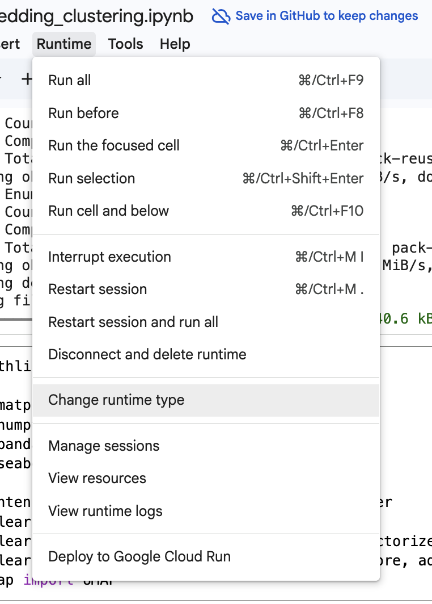

# Connect to a GPU runtime in Google Colab

Some notebooks run much faster with a GPU. Follow these steps to switch your Colab runtime to a GPU before running the notebook.

## 1. Open the Runtime menu

In your open Colab notebook, click **Runtime** in the menu bar.

## 2. Choose "Change runtime type"

From the dropdown, click **Change runtime type**.

## 3. Select the GPU hardware accelerator

In the dialog that appears, select **T4 GPU** under **Hardware accelerator**, then click **Save**.

## 4. Reconnect and run your notebook

Colab will reconnect using the new runtime. Run your notebook cells as usual — they will now execute on the GPU.
