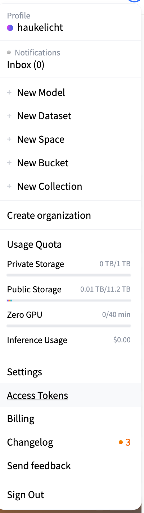
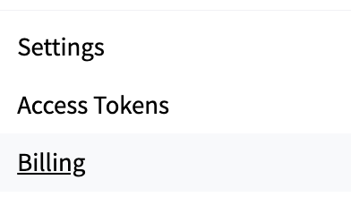
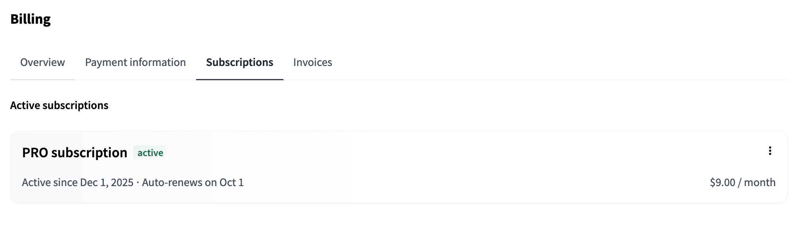
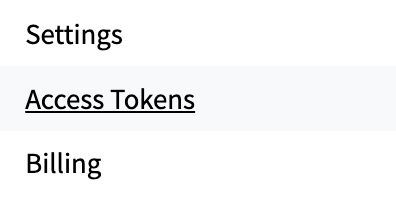
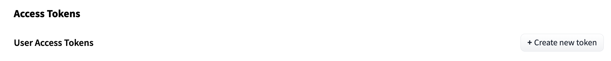
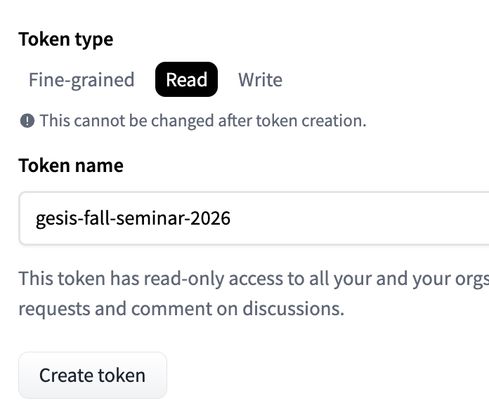
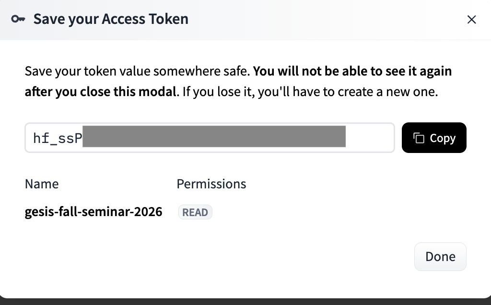
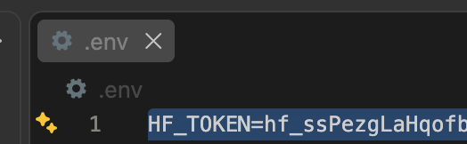

# Hugging Face Pro account and access token

## 1. Create or sign in to a Hugging Face account

Go to [Hugging Face](https://huggingface.co/login) and sign in or create an account.

## 2. Upgrade to a PRO subscription

1. Click your profile avatar in the top-right corner of the page.
2. Open **Settings**.

3. In the settings menu, click **Billing**.

4. In the billing page, open the **Subscriptions** tab.
5. If you do not yet have PRO, click the option to upgrade to **PRO** and complete the payment flow.
6. If your account already shows a **PRO subscription active**, you can continue with the next step.

## 3. Create an access token

1. Open the profile menu again and choose **Access Tokens**.

2. Click **Create new token**.
3. Select token type **Read**.
4. Enter a token name.
5. Click **Create token**.

6. Copy the token immediately and store it somewhere safe. You will only see it once.

## 4. Make the token accessible in VS Code

1. Create a file called `.env` in the root of your project folder. (It is important that the file name starts with a dot.)
2. Open the file in a text editor.
3. Add `HF_TOKEN=` on the first line.
4. Paste your Hugging Face token after the `=` sign.
5. Save the file and close it.

