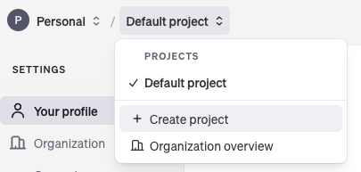
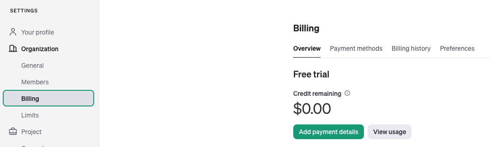
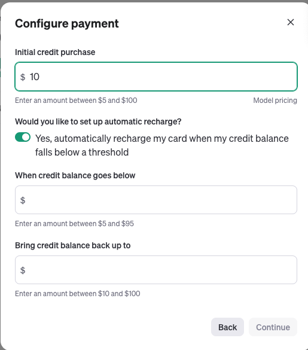
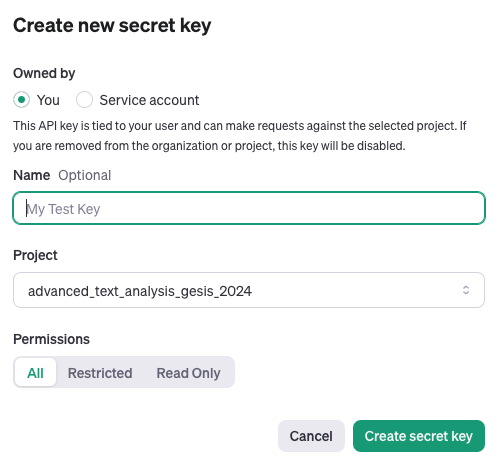

# Open AI account and API access

## 1. Create an OpenAI account

Go to [OpenAI](auth.openai.com/authorize) and sign in our create an account.

## 2. Link a payment method and book some credit

1. go to https://platform.openai.com/settings/organization/general
2. In the top-left of the page-header, select "Personal" as you Organization
3. **optional:** create a new project "advanced_text_analysis_gesis" as shown below.
4. Go to the Billing in the menu on the left (under "**Organzation**")
5. Click on "Add payment details" and link a credit card
6. In the *Configure payment* pop-up (or by clicking "Add to credit balance"), add some credit, e.g., U.S.$ 10

## 3. Get your API key

1. Go to the [API keys](https://platform.openai.com/api-keys) page.
2. Create a new API key by clicking on the "Create new secret key" button.
3. Fill your information in the form shown below and click on the "Create secret key"  button.

**IMPORTANT** &mdash; 
Make sure you **take the step next** to store the API key in a safe place.
This will be the only time you will be able to see your API key. 

## 4. Make your API key accessible in VS Code

1. Create a file called `.env` in the root of your project folder. (It's important that the file name starts with a dot!)
2. Open it in a text editor 
3. Now,
	1. add `OPENAI_API_KEY=` in the first line of the file, 
	2. copy your API key from your browser window,
	3. paste the key in your `.env` file behind the `=`
	4. save the file and close it

## 5. Verify that your API key is accessible in python

Run the code in notebook [test_openai_key.ipynb](./code/test_openai_key.ipynb) to verify that your API key is accessible in VS Code and your API access works.
