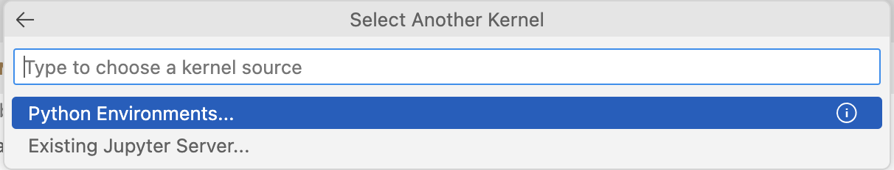

# Setting up VS Code

We will be using _Visual Studio Code_ (VS Code) as a code editor in the workshop.
Please install **VS Code** _before_ the course from https://code.visualstudio.com/Download.

**_Note for Windows users:_** Some python packages we use (e.g., numpy) require a working C++ installation. Please install C++ for VS Code from [here](https://code.visualstudio.com/docs/languages/cpp) as described here [here](https://code.visualstudio.com/docs/cpp/config-msvc).

You will also need to install **Python** and the **conda** package manager.
If you have not done so before, please refer to the setup instructions in [setup_python_with_anconda.md](./setup_python_with_anconda.md).
Alternatively, you can download and install

- Python as described [here](https://www.python.org/downloads)
- and conda as described [here](https://conda.io/projects/conda/en/latest/user-guide/install)

Finally, in VS code, you also need to install the Python and Jupyter **extensions**.
You can do this by clicking on the "Extensions" icon in the left-hand sidebar, searching for "Python" ("Jupyter") and clicking on the "Install" button.

You shouldn't run into any issues if you have admin rights on your computer.
But if you run into difficulties, please check https://code.visualstudio.com/docs/languages/python.
If you don't find a solution, you can also email Hauke at hauke.licht@uibk.ac.at.


### Conda environment

**_Note:_** You can skip this step if you have already completed steps 3 and 4 in [setup_python_with_anconda.md](./setup_python_with_anconda.md).

To ensure that everyone uses the same python and packages versions, we will create and use a virtual conda environment.
For this, you'll need to open 

- the *Anaconda Prompt* app if you are a Windows user, **_or_**
- the *Terminal* app if you are a Mac user

In the Anaconda Prompt/Terminal, execute the following lines (by copy-pasting them there and pressing Enter):

```bash
conda create -n advanced_text_analysis_gesis_2025 -y python=3.11 pip
conda activate advanced_text_analysis_gesis_2025
pip install -r https://raw.githubusercontent.com/haukelicht/advanced_text_analysis/main/setup/requirements.txt
```

### Selecting the conda environment in VS Code

When running some python script or a cell in a Jupyter notebook in VS Code, you will be prompted to select the python interpreter.



In our case, we will always select the `advanced_text_analysis_gesis_2025` environment


**_Alternatives_** 

- create a native python virtual environment (like [this](https://realpython.com/lessons/creating-virtual-environment/)), and/or
- install the required python packages listed the [requirements.txt](setup/requirements.txt) file manually

### Setup the course repo as a project in VS Code

1. If you have not done so yet, clone the github repository as described in [setup_github_clone.md](./setup_github_clone.md)
2. Open the VS Code app
<!-- 3. In the menu (bar at the top of the app window), navigate to File > New Window -->
3. Select Open (folder) option
4. Open the folder named `advanced_text_analysis` you have created by cloning the github repo

This should open the folder as a project in you VS Cod app

### Make local code in `src/` available in Juptyer notebooks

1. In VS Code, open an integrated terminal via the Menu (Terminal > New Terminal). The Terminal window opens in the center-bottom of the app window.
2. in the Terminal, type: `pwd` and hit enter
    - On macOS/Linux, this should print a line starting with `/User/`.
    - On Windows, this should print a line starting with `C:\` (or another capital letter at the beginning, like `D`)
3. Copy this line
4. Create a file called `.env` in the root of your project folder by selecting File > New Text File in the menu. (It's important that the file name starts with a dot!)
5. Open the file in VS Code.
6. Now,
	1. add a new line to the file
    2. begin the line with `PYTHONPATH="`
	3. paste the line you have copied in step (3) above behind the `"` (without a white space)
    4. on
        - macOS/Linux, add `:${PYTHONPATH}`
        - Windows, add ` ${PYTHONPATH}` (with a white space at the beginning)
    5. end the line with `"`
6. In the menu, select File > Save


#### Desired result

The complete line you added to your `.env` file should look like this:

##### on macOS/Linux

```
PYTHONPATH="/Users/hauke/courses/advanced_text_analysis:${PYTHONPATH}"
```

*note:* the part `/hauke/courses/` will be different for you, because you have the folder in a different location on your machine.

##### on Windwos

```
PYTHONPATH="C:\Users\Hauke\Courses\advanced_text_analysis ${PYTHONPATH}"
```

*note:* the part `C:\Hauke\Courses\` will be different for you, because you have the folder in a different location on your machine.
